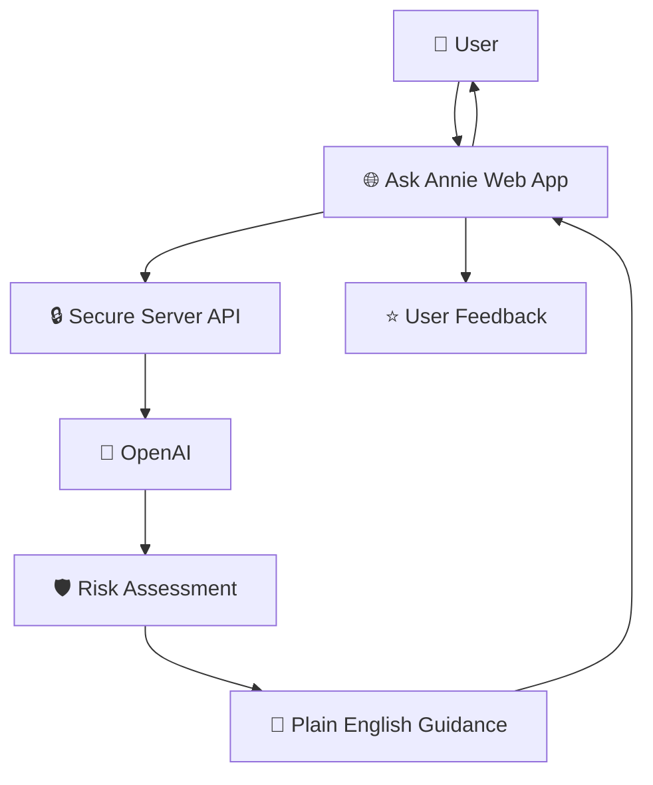

# Ask Annie — Architecture
# Ask Annie Architecture

## Executive Summary

Ask Annie is a cloud-native AI application that helps users make safer digital decisions by analysing suspicious messages, screenshots and online content.

The architecture has been deliberately designed to:

- Deliver an MVP quickly
- Protect user privacy
- Keep operational complexity low
- Support future enterprise scaling
- Follow responsible AI principles
- Be accessible by default

---

# High-Level Architecture

---

# Architecture Principles

The platform is built around six principles.

## 1. Accessibility First

Everyone should be able to use Ask Annie regardless of technical confidence.

---

## 2. Privacy by Design

Only process the minimum information required.

---

## 3. Explain the Reasoning

Never simply return a score.

Always explain why.

---

## 4. Guidance not Guarantees

Annie helps people make better decisions.

She does not make decisions for them.

---

## 5. Calm User Experience

Every interaction should reduce anxiety.

---

## 6. Security by Default

Secrets remain server-side.

No sensitive content is stored unnecessarily.

---

# Core Components

| Component | Responsibility |
|------------|----------------|
| Web Application | User experience |
| API Layer | Validation and security |
| OpenAI | Content analysis |
| Assessment Engine | Structured risk analysis |
| Guidance Engine | Plain English explanations |
| Feedback Service | Product improvement |

---

# Technology Stack

| Layer | Technology |
|---------|------------|
| Frontend | React / TypeScript |
| Backend | Replit |
| AI | OpenAI API |
| Source Control | GitHub |
| IDE | VS Code |
| AI Coding | Replit Agent + Codex |

---

# Version 0.1 Scope

The MVP intentionally excludes:

- User accounts
- Payments
- Chat history
- Personal data storage
- Social features

The objective is to validate the core user experience before expanding functionality.

---

# Future Architecture

Future versions may include:

- Mobile applications
- Voice interaction
- Trusted contacts
- Email forwarding
- Browser extension
- QR code analysis
- Enterprise deployment
- Multi-language support
- Analytics platform
